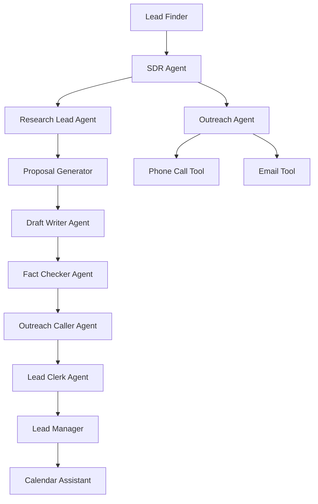

# 🚀 SalesShortcut - AI-Powered SDR Agent System

A comprehensive AI-powered Sales Development Representative (SDR) system built with multi-agent architecture for automated lead generation, research, proposal generation, and outreach.

## 🏗️ Architecture

SalesShortcut consists of 4 specialized microservices working together:

### Core Services

- **🔍 Lead Finder** - Discovers potential business leads in specified cities using Google Maps and location-based search
- **🧠 SDR Agent** - Main orchestrator conducting research, proposal generation, and outreach (includes phone calls and email)
- **📋 Lead Manager** - Manages lead data and tracks conversion status
- **🖥️ UI Client** - Web dashboard for monitoring and controlling the entire system

### Agent Workflow



## ✨ Key Features

### Lead Generation
- **Geographic targeting** - Find businesses in any specified city
- **Google Maps integration** - Leverage Maps API for accurate business data
- **Intelligent clustering** - Group similar businesses for targeted campaigns

### AI-Powered Research
- **Comprehensive business analysis** - Understand target business needs and pain points  
- **Competitor research** - Analyze market position and opportunities
- **Review analysis** - Extract insights from customer feedback
- **Website assessment** - Identify digital presence gaps

### Personalized Outreach
- **Custom proposal generation** - AI-crafted proposals based on research findings
- **Multi-channel communication** - Phone calls via ElevenLabs + email outreach
- **Professional voice calls** - Natural AI voice conversations with prospects
- **Email automation** - SMTP-based email delivery with personalized content

### Lead Management
- **Automated follow-up** - Track engagement and schedule next actions
- **Status tracking** - Monitor leads through the entire sales funnel
- **Meeting scheduling** - Integrate with calendar systems for appointments
- **Data persistence** - Store all interactions in BigQuery for analytics

## 🛠️ Technology Stack

- **Framework**: Python with FastAPI and Google ADK Agents
- **AI Models**: Gemini 2.0 Flash Lite (configurable)
- **Voice**: ElevenLabs API for natural phone conversations
- **Database**: Google BigQuery for data storage and analytics
- **APIs**: Google Maps, Google Search, SMTP for email
- **Frontend**: HTML/CSS/JavaScript with WebSocket real-time updates
- **Deployment**: Docker containers with Cloud Run support

## 📋 Prerequisites

- Python 3.8+
- Google Cloud Project with BigQuery enabled
- API Keys:
  - Google API Key (for Gemini LLM)
  - Google Maps API Key
  - ElevenLabs API Key (for voice calls)
  - Optional: OpenAI, Anthropic keys

## 🚀 Quick Start

### 1. Clone and Setup

```bash
git clone <repository-url>
cd SalesShortcut
cp .env.example .env
# Edit .env with your API keys
```

### 2. Environment Configuration

Update `.env` with your API credentials:

```env
# Required
GOOGLE_API_KEY=your_google_api_key_here
GOOGLE_MAPS_API_KEY=your_maps_api_key_here

# For Voice Calls
ELEVENLABS_API_KEY=your_elevenlabs_key_here
ELEVENLABS_AGENT_ID=your_agent_id_here
ELEVENLABS_PHONE_NUMBER_ID=your_phone_number_id_here

# Email Configuration
EMAIL_USERNAME=your_email@gmail.com
EMAIL_PASSWORD=your_app_password_here
FROM_EMAIL=your_email@gmail.com

# Optional
OPENAI_API_KEY=your_openai_key_here
ANTHROPIC_API_KEY=your_anthropic_key_here
```

### 3. Install Dependencies

```bash
pip install -r requirements.txt
```

### 4. Run the System

#### Option A: Run All Services Locally
```bash
# Start all services
./deploy_local.sh

# Or start individual services
python -m lead_finder --port 8081
python -m lead_manager --port 8082
python -m sdr --port 8084  
python -m ui_client --port 8000
```

#### Option B: Docker Deployment
```bash
# Build and deploy with Docker
make build-all
make deploy-local
```

### 5. Access the Dashboard

Open your browser to `http://localhost:8000` to access the web interface.

## 📖 Usage Guide

### Finding Leads

1. **Enter Target City**: Use the web interface to specify a city for lead generation
2. **Automatic Discovery**: The system finds businesses without websites in that area
3. **View Results**: Monitor discovered leads in the dashboard

### SDR Process

1. **Select Leads**: Choose businesses from the lead finder results
2. **Automated Research**: SDR agent researches each business thoroughly
3. **Proposal Generation**: AI creates personalized website development proposals
4. **Phone Outreach**: System makes professional calls to business owners
5. **Email Follow-up**: Sends detailed proposals via email to interested prospects
6. **Lead Tracking**: Monitors responses and schedules follow-up activities

### Dashboard Features

- **Real-time Updates**: WebSocket-powered live status updates
- **Lead Management**: View, filter, and manage all prospects
- **Call Monitoring**: Track phone call outcomes and transcripts
- **Analytics**: Monitor conversion rates and campaign performance

## 🔧 Configuration

### Model Settings
```python
# In any service's config.py
MODEL = "gemini-2.0-flash-lite"  # or "gpt-4", "claude-3-sonnet"
TEMPERATURE = 0.2
TOP_P = 0.95
TOP_K = 40
```

### Service URLs
Services communicate via HTTP/A2A protocol. Default ports:
- UI Client: 8000
- Lead Finder: 8081  
- Lead Manager: 8082
- SDR: 8084

## 🐳 Docker Deployment

Each service has its own Dockerfile and can be deployed independently:

```bash
# Build specific service
docker build -f Dockerfile.sdr -t salesshortcut-sdr .

# Deploy to Cloud Run
gcloud run deploy salesshortcut-sdr --source .
```

## 📊 Data Storage

The system uses Google BigQuery for persistent storage:

- **Lead Data**: Business information, contact details, research results
- **Interaction History**: Call transcripts, email responses, follow-up activities  
- **Analytics**: Conversion metrics, campaign performance data

## 🔐 Security & Privacy

- All API keys stored securely in environment variables
- Phone calls comply with telemarketing regulations
- Business data encrypted in transit and at rest
- No sensitive information logged or exposed

## 🤝 Contributing

1. Fork the repository
2. Create a feature branch
3. Make your changes
4. Add tests if applicable
5. Submit a pull request

## 📄 License

This project is licensed under the MIT License - see the LICENSE file for details.

## 🆘 Support

For issues, questions, or feature requests:

1. Check the troubleshooting section in individual service READMEs
2. Review service logs for error details
3. Open an issue on GitHub with detailed information

---

**Built with ❤️ for automating the sales development process**